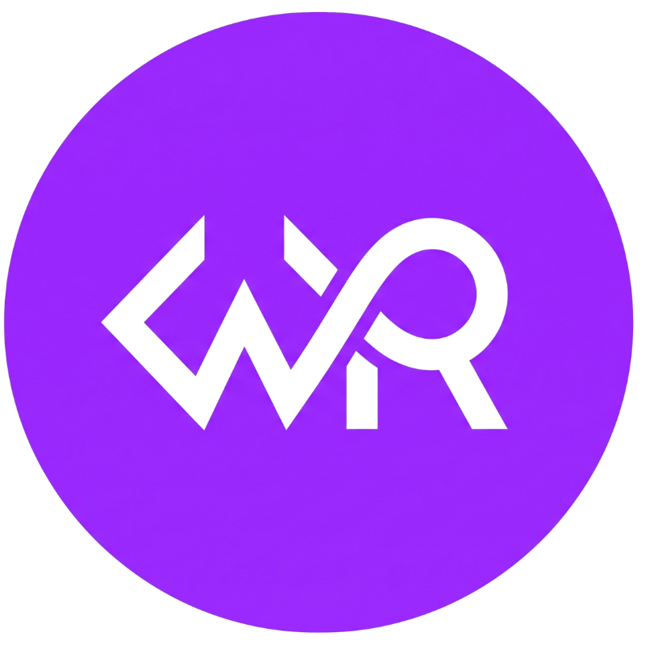

# 🚀 DevSecOps Portfolio | Will Rodrigues

<p align="center">
  
</p>

<p align="center">
  <strong>William Rodrigues</strong><br>
  <em>Desenvolvedor Backend | Entusiasta DevOps | Pós-Graduando em Cibersegurança</em>
</p>

<p align="center">
  <a href="https://github.com/Wiillrodriigues"></a>
  <a href="https://wa.me/5511967613438?text=Ol%C3%A1%2C%20William!%20Vi%20seu%20portf%C3%B3lio%20e%20gostaria%20de%20conversar."></a>
</p>

---

## 📌 Sobre o Projeto

Este repositório armazena o código-fonte do meu **Portfólio Profissional Pessoal**. Desenvolvido com uma interface moderna, limpa e totalmente responsiva, o objetivo principal deste projeto é centralizar a apresentação das minhas competências técnicas, os projetos arquitetados no ecossistema backend e soluções voltadas à automação e segurança defensiva.

O site foi customizado e reconstruído a partir de uma base open-source para refletir a minha identidade técnica, com foco na legibilidade de métricas, infraestrutura e especialidades de engenharia de software.

---

## 🛠️ Stack Tecnológica

O ecossistema do front-end deste portfólio foi construído utilizando ferramentas modernas que visam performance e modularidade:

* **Core:** React.js (Componentização baseada em funções e hooks funcionais)
* **Estilização:** Tailwind CSS (Utilitários JIT para estilização responsiva e fluida)
* **UI Components:** DaisyUI (Framework de componentes semânticos e acessíveis)
* **Navegação Interna:** React Scroll (Implementação de Single Page Application com transições e rolagem suave)
* **Build Tool & Bundler:** Vite (Ambiente ultra-rápido de Hot Module Replacement)

---

## ⚙️ Arquitetura e Funcionalidades Customizadas

* **Menu Inteligente Dual-Mode:** Navbar adaptável com botão de destaque em telas grandes e colapso automático para Menu Hambúrguer integrado em resoluções móveis, otimizando o espaço de tela.
* **Prevenção de Bugs de Visualização (Safe Render):** Tratamento de interceptações do DOM e através de isolamento semântico no mapeamento de componentes, evitando falhas de estilização disparadas por tradutores de navegadores móveis.
* **Performance Otimizada:** Carregamento assíncrono de componentes e assets estáticos para garantir carregamento instantâneo mesmo sob conexões móveis limitadas.

---

## 💻 Configuração do Ambiente Local

Para clonar e rodar esta aplicação localmente no seu ambiente Linux, siga as instruções abaixo:

### Pré-requisitos
Certifique-se de ter instalado em sua máquina o **Node.js** (versão LTS recomendada) e o gerenciador de pacotes **npm**.

### 1. Clonar o Repositório
```bash
git clone [https://github.com/Wiillrodriigues/meu-portfolio.git](https://github.com/Wiillrodriigues/meu-portfolio.git)
cd meu-portfolio